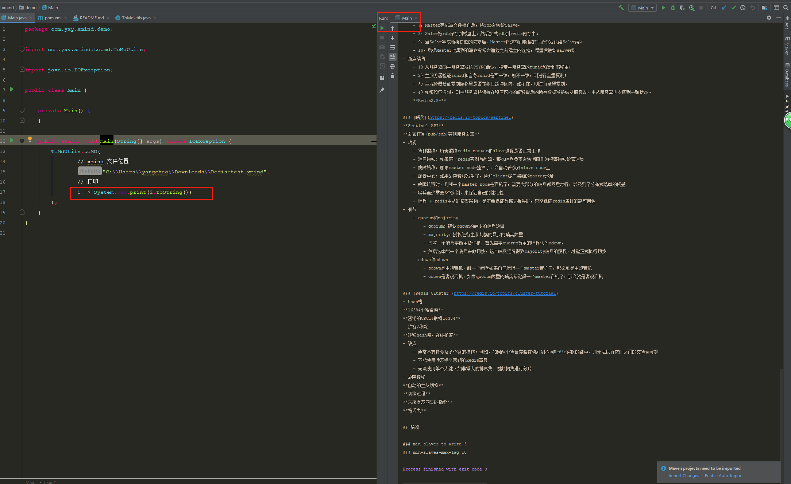
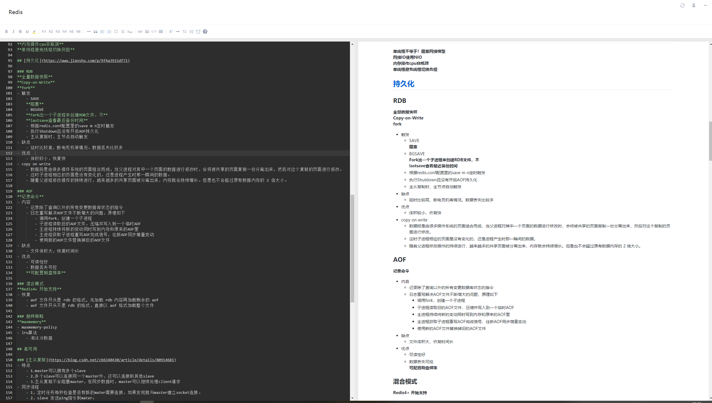
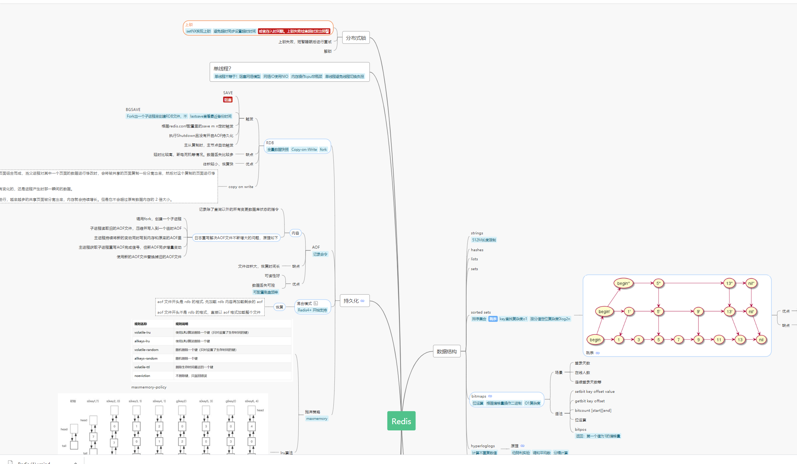

# XMind To Markdown
XMind思维导图转Markdown文本
## 效果
- 效果图1

- 效果图

- 原始脑图

## Demo
[Deom](src/main/java/com/yxy/demo/Main.java)
```java
package com.yxy.demo;

import com.yxy.to.md.XMindToMdUtils;
import java.io.IOException;

public class Main {

    private Main() {
    }

    public static void main(String[] args) throws IOException {
        XMindToMdUtils.getInstance().toMD(
                // xmind 文件位置
                "C:\\Users\\yangchao\\Downloads\\Redis-test.xmind",
                // 打印
                i -> System.out.print(i.toString())
        );
    }
}
```
## 支持
- 超链接
- 图片
- 多层级主题
- 多行主题转列表
- 标签（Labels）

## 限制
1. 需要有文件目录的写权限  
    *因为需要解压XMind文件读取内部xml*
2. 暂时不支持读取remark  
    *因为解析遇到点问题，有会的朋友欢迎push一下。或者留言。不胜感谢๑乛◡乛๑*
